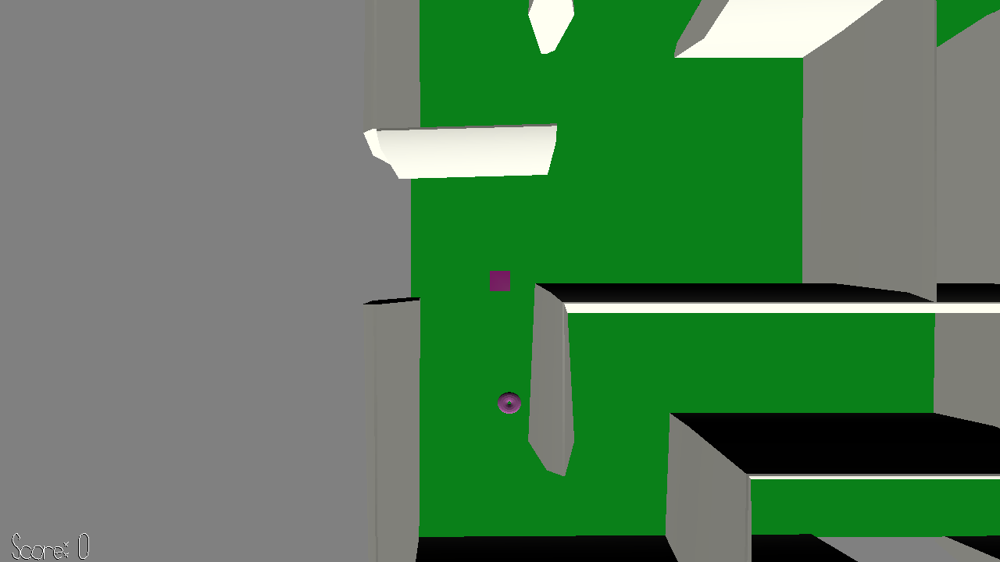

# Pac Man: Invisible Ghost

Author: Tianjian Huang  <thuang2@andrew.cmu.edu>

## Design

This game is like Pac Man. You are searching for donuts to eat in a labyrinth.

What's new: Like Pac Man, there will be ghosts on your way. However, in this game the ghosts are invisible. You can only hear them. 

The labyrinth is constrained by walkmesh. The player can only walk on walkmesh, so cannot cross the wall.

## Screen Shot

## How To Play

WASD to move. Get the donuts as much as possible, but try not to hit on a ghost.

The ghosts are invisible, and they will change their positions randomly. But if you are enough close to them, there will be alarm sounds.

## Sources

Inspired by https://github.com/bobowitz/15-466-f20-base5

Music:

ghost.wav by:  jabbersynth - Saltbearer https://freesound.org/people/Saltbearer/sounds/536423/ 

Labyrinth model: https://www.turbosquid.com/3d-models/free-small-maze-3d-model/686346

Donut model: https://github.com/bobowitz/15-466-f20-base5

This game was built with [NEST](NEST.md).

